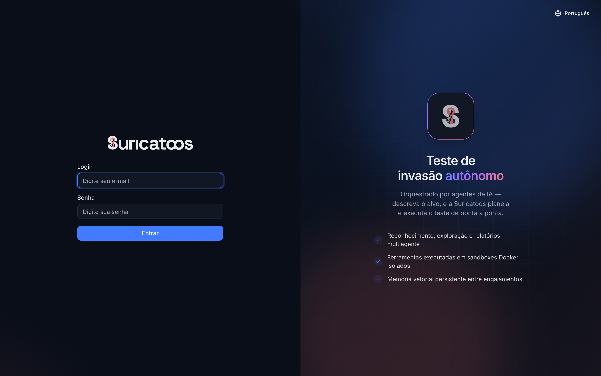
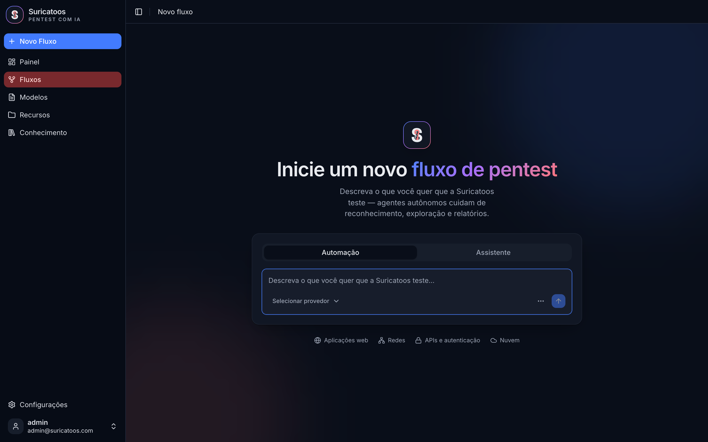
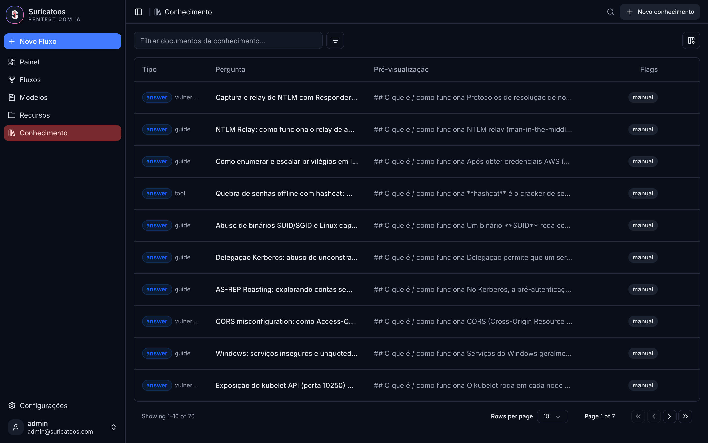
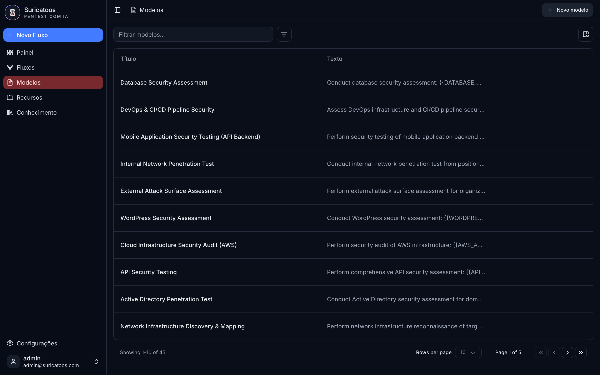
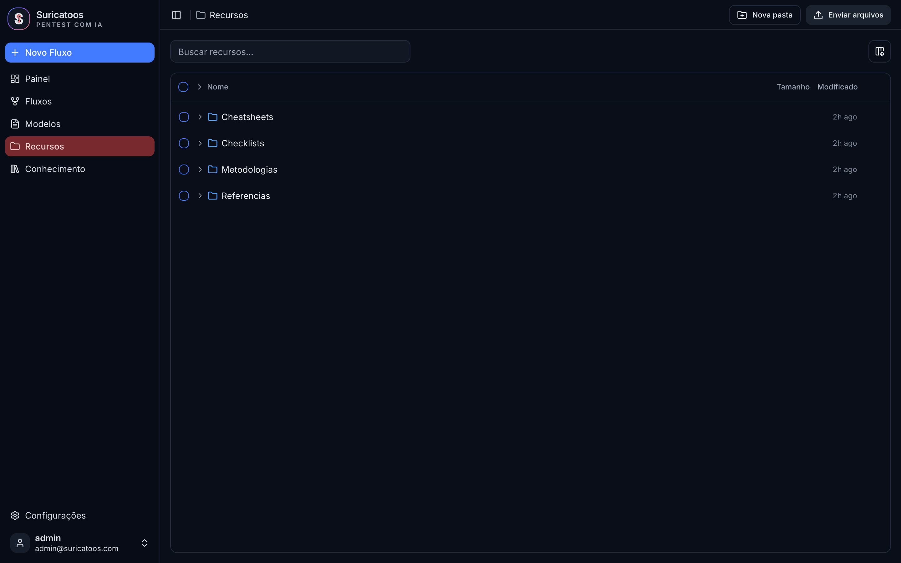
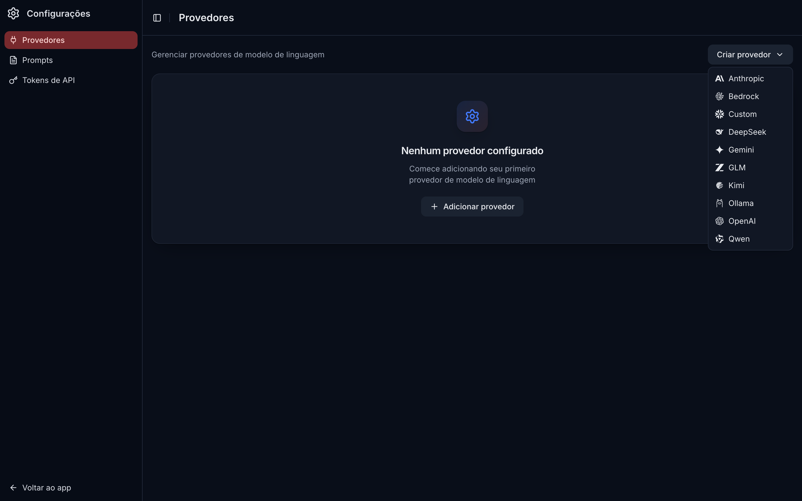
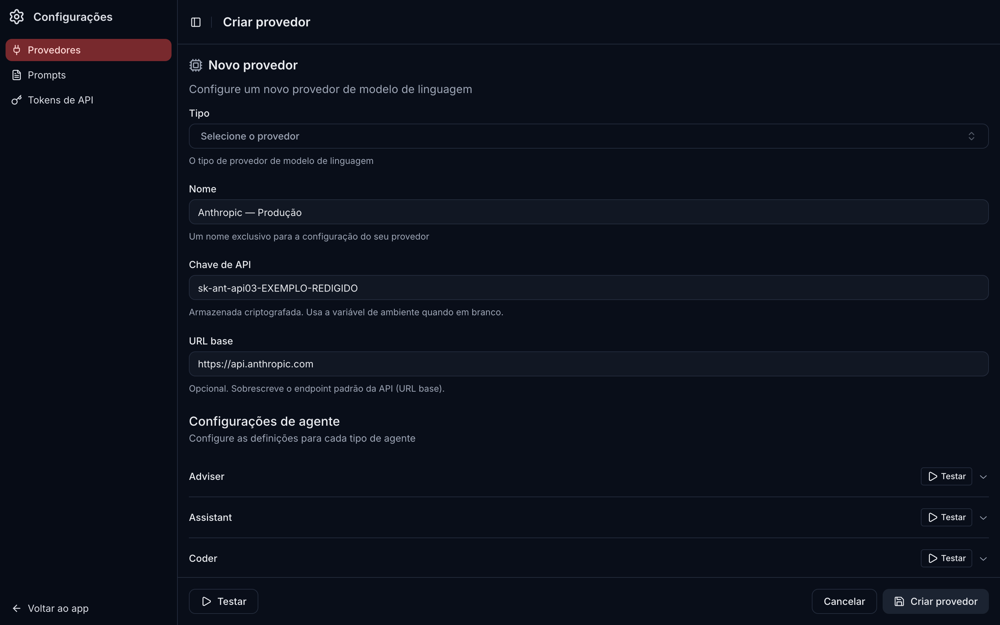
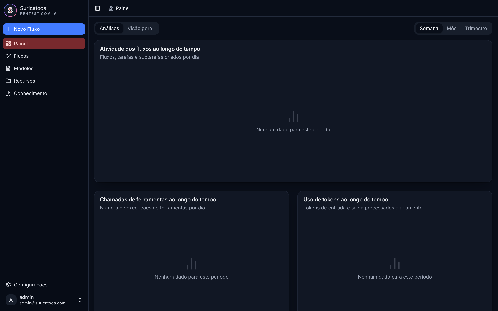

<div align="center">



# Suricatoos

**Pentest autônomo orquestrado por agentes de IA.**
Descreva o alvo — a Suricatoos planeja e executa reconhecimento, exploração e relatórios de ponta a ponta.


</div>

---

> ⚠️ **Uso autorizado apenas.** A Suricatoos é uma ferramenta ofensiva destinada a testes de
> segurança **com autorização explícita por escrito** (pentest, red team, CTF, laboratórios e
> pesquisa). Use somente em sistemas que você possui ou está contratado para testar.

## ✨ Por que Suricatoos

A Suricatoos é um fork da plataforma open-source **[PentAGI](https://github.com/vxcontrol/pentagi)**
— um sistema multiagente (Pesquisador · Desenvolvedor · Executor) que coordena LLMs, executa
ferramentas em **sandboxes Docker isolados** e mantém uma **memória vetorial persistente** entre
engajamentos.

Sobre essa base, a Suricatoos adiciona uma camada de produto pensada para **red team, pentest e
operações ofensivas em português**:

| | O que a Suricatoos adiciona |
|---|---|
| 🎨 **Identidade & design** | Marca própria (suricata azul/coral) e redesign completo da interface interna — visual de produto, tema escuro, foco em densidade de informação. |
| 🌍 **Três idiomas** | Interface 100% traduzida em **pt-BR (padrão)**, **inglês** e **espanhol**, com troca em tempo real. |
| 🔑 **Chaves de LLM na interface** | Cadastre provedores e chaves de API direto na UI — **armazenadas criptografadas (AES-256-GCM)**, sem depender só de variáveis de ambiente. |
| 🧠 **Base de conhecimento ofensivo** | **70 documentos** técnicos (pergunta → resposta, em pt-BR) com **busca semântica 100% local** (Ollama `bge-m3` + pgvector) — sem enviar dados a terceiros. |
| 🎯 **Biblioteca de modelos** | **45 modelos de engajamento** prontos (34 playbooks ofensivos curados pela Suricatoos): AD, cloud, API, web, rede interna, mobile, DevSecOps… |
| 📚 **Recursos de referência** | **25 documentos** organizados em Cheatsheets, Checklists, Metodologias e Referências. |
| 📄 **Relatórios multi-formato** | Relatório **técnico** em `.docx` / `.pptx` / `.pdf` e **executivo** em `.pptx` / `.pdf`, gerados no navegador. |

## 📸 Telas

| Novo fluxo de pentest | Base de conhecimento (70 docs) |
|---|---|
|  |  |
| **Modelos de engajamento** | **Recursos de referência** |
|  |  |
| **Provedores de LLM** | **Chave de API na interface** |
|  |  |
| **Painel de análises** | |
|  | |

## 🧠 Conteúdo ofensivo incluído (no seed)

Já vem populado no primeiro `up`, pronto para uso:

- **🎯 45 modelos de engajamento** — escopos prontos para AD, infraestrutura interna/externa,
  cloud (AWS), APIs, WordPress, mobile, pipelines DevSecOps e mais.
- **📚 25 recursos de referência:**
  - `Cheatsheets/` (9) · `Checklists/` (6) · `Metodologias/` (7) · `Referencias/` (3)
  - Inclui PTES, OWASP WSTG, OWASP API Top 10, MITRE ATT&CK red-team, privesc Linux/Windows,
    triagem K8s/cloud, IAM/storage/secrets…
- **🧩 70 documentos de conhecimento** — respostas técnicas em pt-BR (SQLi cego, NTLM relay,
  Kerberos/AS-REP roasting, abuso de SUID/SGID, CORS, exposição de kubelet…), indexados para
  **busca semântica local**.

### Busca semântica 100% local

A indexação usa **Ollama** com o modelo multilíngue **`bge-m3`** (1024 dimensões) e **pgvector**.
Nenhum conteúdo de conhecimento sai da sua infraestrutura para ser pesquisado.

## 🔑 Provedores de LLM na interface

Configure quantos provedores quiser direto em **Configurações → Provedores**: Anthropic, OpenAI,
Gemini, Bedrock, DeepSeek, GLM, Kimi, Qwen, Ollama ou um endpoint **personalizado**. As chaves são
**cifradas com AES-256-GCM** antes de ir ao banco (prefixo `enc:v1:`) e, se o campo ficar em branco,
o sistema usa a variável de ambiente correspondente.

## 🌍 Internacionalização

Interface em **pt-BR (padrão)**, **inglês** e **espanhol**. As strings em inglês servem como chave;
traduções ausentes caem de volta para o inglês automaticamente, sem quebrar a tela. Troca de idioma
em tempo real pelo menu do usuário.

## 📄 Relatórios de exemplo

Um **relatório PTES** no padrão de livro caprichado — **storytelling** (narrativa do ataque),
**plano de ação** com quick wins e tempo de correção, **gráficos avançados** (medidor de risco,
matriz 5×5, quadrante impacto×esforço, linha do tempo) e **co-branding whitelabel** (logo da
aplicação + logo do cliente). Os três formatos são **visualmente consistentes** entre si:

| Formato | Arquivo |
|---|---|
| 📕 PDF | [suricatoos-relatorio-ptes.pdf](docs/sample-reports/suricatoos-relatorio-ptes.pdf) |
| 📘 Word | [suricatoos-relatorio-ptes.docx](docs/sample-reports/suricatoos-relatorio-ptes.docx) |
| 📙 PowerPoint | [suricatoos-relatorio-ptes.pptx](docs/sample-reports/suricatoos-relatorio-ptes.pptx) |

## 🏗️ Arquitetura & stack

| Caminho | Papel | Tecnologias |
|---|---|---|
| `backend/` | API REST + GraphQL e orquestração dos agentes | **Go**, gqlgen, sqlc, goose, GORM, **pgvector** |
| `frontend/` | Interface web | **React 19**, TypeScript, Vite, Tailwind v4, shadcn/ui, Apollo |
| `observability/` | Monitoramento opcional | OpenTelemetry, Grafana, Langfuse |

- **Marca:** azul `#194FE3` · coral `#FF7678` · branco — mascote suricata formando a letra **"S"**.
- **Execução de ferramentas:** sandboxes Docker isolados por fluxo.

## 🚀 Início rápido

```bash
cp .env.example .env          # preencha o banco + ao menos um provedor de LLM
docker compose up -d
```

A stack completa sobe em `https://localhost:8443`. As chaves de LLM também podem ser cadastradas
depois, pela própria interface.

### Desenvolvimento

```bash
# Backend (Go) — em backend/  (módulo Go: suricatoos)
go build -o suricatoos ./cmd/suricatoos
go test ./...

# Frontend (React + Vite) — em frontend/
pnpm install
pnpm run dev
```

> A busca semântica do Conhecimento requer o **Ollama** com o modelo `bge-m3`
> (`ollama pull bge-m3`).

## 🔐 Segurança & responsabilidade

- Segredos de provedores são **criptografados em repouso** (AES-256-GCM).
- Ferramentas rodam em **contêineres isolados**, não no host.
- Esta é uma ferramenta de **segurança ofensiva**: utilize-a apenas dentro de um **escopo
  autorizado**. Você é responsável pelo cumprimento das leis e contratos aplicáveis.

## 🙌 Créditos & licença

A Suricatoos é um fork de **[PentAGI](https://github.com/vxcontrol/pentagi)**, criado por
[vxcontrol](https://github.com/vxcontrol). Todo o crédito pela arquitetura e funcionalidade central
pertence ao projeto original. O copyright do upstream e os arquivos `LICENSE`, `NOTICE` e `EULA.md`
são **preservados sem alteração** — revise-os antes de qualquer redistribuição.

Consulte [CLAUDE.md](CLAUDE.md) para o guia de desenvolvimento e notas de arquitetura.
