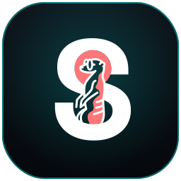

<h1 align="center">Suricatoos CISO</h1>

<p align="center">
  <strong>Plataforma open-source de Governança, Risco e Conformidade (GRC)</strong><br/>
  <em>always alert · always watching</em>
</p>

<p align="center">
  
</p>

---

> [!IMPORTANT]
> **Suricatoos CISO** é um *fork* com a marca [Suricatoos](https://www.suricatoos.com) do projeto
> [**CISO Assistant**](https://github.com/intuitem/ciso-assistant-community), desenvolvido por
> [intuitem](https://intuitem.com). Distribuído sob a licença **AGPLv3** (edição community).
> Todo o crédito da plataforma base é da intuitem e da comunidade CISO Assistant — veja
> [Atribuição & Licença](#atribuição--licença).

## O que é

Suricatoos CISO é um hub central para gestão de cibersegurança e **GRC** (Governança, Risco e Conformidade):

- Conecta múltiplos conceitos de cibersegurança com vínculos inteligentes entre objetos;
- Ferramenta **multi-paradigma**, que se adapta a diferentes metodologias e contextos;
- **Desacopla** conformidade dos controles de segurança, permitindo reuso em toda a plataforma;
- Abordagem **API-first**, suportando tanto a interface quanto **automação** externa;
- Vem com uma ampla biblioteca embutida de normas, controles de segurança e catálogos de ameaças;
- **Avaliação de risco** e acompanhamento de remediação integrados;
- Rico em **import/export** (UI, CLI, Kafka, relatórios, etc.).

## Identidade Suricatoos

Este fork aplica a identidade visual da Suricatoos sobre a base CISO Assistant:

- **Nome de produto**: `Suricatoos CISO` em toda a interface, e-mails e títulos;
- **Logo/marca**: mascote suricata em badge escuro (`frontend/src/lib/assets/ciso.svg`), favicon multi-resolução e `apple-touch-icon`;
- **Paleta**: preto/near-black + ciano neon `#00e3e3` (primário) + coral `#ff7678` (acento), via tema Skeleton em `frontend/ciso-theme.css`;
- **Tipografia**: Space Grotesk (display/corpo) + JetBrains Mono (mono), self-hospedadas em `frontend/static/fonts`.

> Arquivos de licença e avisos de copyright da intuitem são **preservados** conforme exige a AGPLv3.

## Quick Start 🚀

Com _Docker_ e _Docker Compose_ instalados (>= 27.0):

```sh
git clone --single-branch -b main <URL-DO-SEU-FORK>.git
cd suricatoos-platform
./docker-compose.sh     # Linux/macOS
./docker-compose.ps1    # Windows
```

Informe e-mail e senha do superusuário quando solicitado, depois acesse
[https://localhost:8443/](https://localhost:8443/).

Para outras opções de self-hosting, veja o [config builder](./config/).

## Setup de desenvolvimento

Requisitos: Python 3.14+, uv 0.9+, Node 24+, pnpm 10.30+ (`apt install libyaml-cpp-dev`).

**Backend**

```sh
cd backend
uv sync
uv run python manage.py migrate
uv run python manage.py createsuperuser
uv run python manage.py runserver
```

**Frontend**

```sh
cd frontend
npm install -g pnpm
pnpm install
pnpm run dev    # http://localhost:5173
```

Veja a documentação técnica em [`product-docs/`](./product-docs/) e
[`documentation/`](./documentation/).

## Frameworks suportados 🛡️

A plataforma traz **mais de 110 frameworks** embutidos (ISO 27001, NIST CSF 1.1/2.0, NIS2, SOC2,
PCI DSS, GDPR, DORA, CMMC, EU AI Act, e muitos outros), além de contribuições da comunidade.
A lista completa e atualizada está nos [docs do projeto base](https://intuitem.gitbook.io/ciso-assistant)
e no diretório [`backend/library/libraries/`](./backend/library/libraries/).

Você também pode adicionar suas **próprias bibliotecas** (frameworks, catálogos de ameaças, matrizes
de risco) carregando arquivos Excel diretamente pela página **Governança → Biblioteca**. Veja
[`tools/README.md`](./tools/README.md) para o formato esperado.

## Construído com 💙

[Django](https://www.djangoproject.com/) · [SvelteKit](https://kit.svelte.dev/) ·
[eCharts](https://echarts.apache.org) · [unovis](https://unovis.dev) ·
[Caddy](https://caddyserver.com) · [PostgreSQL](https://www.postgresql.org/) ·
[Huey](https://huey.readthedocs.io/) · [inlang](https://inlang.com/)

## Atribuição & Licença

Suricatoos CISO é um trabalho derivado de **CISO Assistant**, © **intuitem**.

Este repositório contém o código da edição Open Source (Community), sob **AGPL v3**, e da edição
comercial (diretório `enterprise/`), sob a *intuitem Commercial Software License*. Todos os arquivos
**fora** do diretório `enterprise/` estão sob [AGPLv3](https://choosealicense.com/licenses/agpl-3.0/);
os de **dentro** dele, sob a licença comercial da intuitem. Salvo indicação em contrário, todos os
arquivos são © intuitem.

- Projeto base: <https://github.com/intuitem/ciso-assistant-community>
- Detalhes da licença: [LICENSE.md](./LICENSE.md) · [LICENSE-AGPL.txt](./LICENSE-AGPL.txt)

A marca, o logo e o nome **Suricatoos** são da Suricatoos e identificam apenas este fork; não implicam
endosso por parte da intuitem. As marcas **CISO Assistant** e **intuitem** pertencem à intuitem.

## Segurança

Reporte vulnerabilidades de forma responsável. Para questões relativas à plataforma base, consulte
também <security@intuitem.com>.
